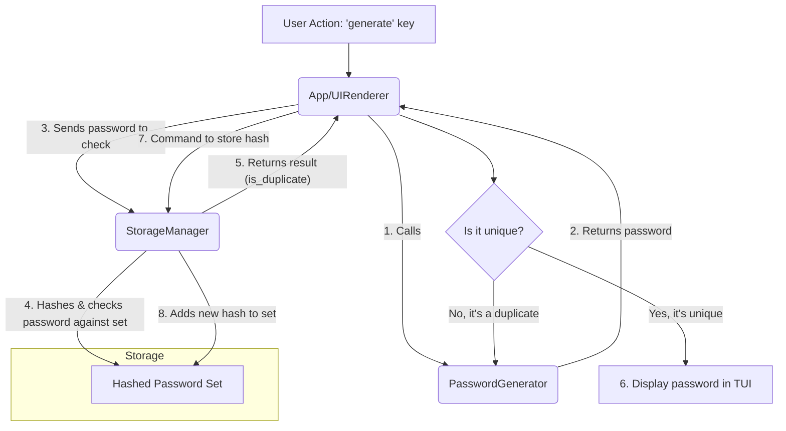

# Rust TUI Password Generator: Architectural Design

This document outlines the architecture for a Rust-based TUI application that generates unique, random passwords in the format `Adjective+Symbol+Noun+Symbol+Number[0,9999]`.

## 1. Crate Recommendations

### TUI Framework
*   **Crate:** `ratatui`
*   **Reasoning:** `ratatui` is a community-driven fork of the unmaintained `tui-rs` crate, ensuring active development and support. It provides all the necessary components (widgets, layouts, text styling) to build a sophisticated and responsive TUI. Its backend-agnostic design allows it to work seamlessly with different terminal backends like `crossterm`.

### Randomness
*   **Crate:** `rand`
*   **Reasoning:** The `rand` crate is the standard for generating random numbers in Rust. It offers a robust and cryptographically secure random number generator (CSPRNG), which is essential for creating unpredictable passwords. We will use it for selecting adjectives, nouns, symbols, and the trailing number.

### Hashing and Security
*   **Crate:** `blake3`
*   **Reasoning:** To ensure generated passwords are never repeated, we will store a hash of each password. `blake3` is a modern, high-performance cryptographic hash function that is faster than SHA-3, SHA-2, SHA-1, and MD5, while providing a high level of security. Storing hashes instead of plaintext passwords prevents the history from being trivially read.
*   **Alternative:** `sha2` could also be used, but `blake3` offers superior performance, which is beneficial when checking for hash collisions against a potentially large set of previously generated hashes.

## 2. Component Design

The application will be composed of three primary components:

### A. PasswordGenerator
*   **Responsibility:** Creates new passwords according to the specified format.
*   **Functionality:**
    *   Maintains internal, immutable lists of adjectives and nouns.
    *   Contains a small, hardcoded list of symbols (e.g., `!@#$%^&*-=_+£`).
    *   Uses the `rand` crate to randomly select one adjective, one noun, and two symbols.
    *   Uses the `rand` crate to generate a number between 0 and 9999.
    *   Assembles these parts into the final password string.
*   **Interaction:** It will be called by the `App` component when the user requests a new password. It returns the generated password string to the `App`.

### B. StorageManager
*   **Responsibility:** Persistently stores and checks for the existence of password hashes to prevent duplicates.
*   **Functionality:**
    *   Initializes the storage backend on application startup. This includes creating a hidden file or database if it doesn't exist.
    *   Provides a function `is_duplicate(hash: &str) -> bool` that checks if a given hash already exists in storage.
    *   Provides a function `store_hash(hash: &str)` that saves a new hash to storage.
    *   Computes hashes using `blake3`.
*   **Interaction:** The `App` component will provide a newly generated password to the `StorageManager`, which first hashes it and then checks for duplicates. If it's not a duplicate, the `StorageManager` stores the new hash.

### C. UIRenderer / App
*   **Responsibility:** Manages the application state, handles user input, and renders the TUI.
*   **Functionality:**
    *   Initializes the terminal and the `ratatui` interface.
    *   Contains the main application loop.
    *   Holds the current application state, including the currently displayed password (if any) and any status messages (e.g., "Generating...").
    *   On a user command (e.g., pressing a key), it triggers the password generation process.
    *   Continuously calls `PasswordGenerator` and `StorageManager` until a unique password has been generated.
    *   Displays the final, unique password to the user.
*   **Interaction:** This is the central component. It orchestrates the actions of the `PasswordGenerator` and `StorageManager` and presents the result to the user.

### Component Interaction Diagram

## 3. Storage Strategy

*   **What will be stored:** A `HashSet` of `blake3` hashes of the generated passwords. Storing only the hashes makes it computationally infeasible to reverse them back into the original passwords, thus securing the history. The use of a `HashSet` provides O(1) average-case time complexity for lookups, ensuring that checking for duplicates remains fast even with a large number of generated passwords.
*   **Where it will be stored:** The `HashSet` of hashes will be serialized and stored in a single binary file.
    *   **File Location:** The file will be placed in a hidden directory within the user's home directory (e.g., `~/.config/rustle-tui/history.bin` on Linux/macOS or `%APPDATA%\rustle-tui\history.bin` on Windows). The `dirs` crate can be used to locate the appropriate directory in a cross-platform way.
    *   **Serialization:** The `bincode` crate will be used to serialize the `HashSet` into a compact binary format. `bincode` is efficient and tightly integrated with Rust's `serde` framework.
*   **Security and User Access Prevention:**
    *   **Obfuscation:** Placing the file in a hidden application-specific configuration directory makes it unlikely for a typical user to find or interact with it.
    *   **No Plaintext:** Since only hashes are stored, the file contains no human-readable information about the passwords.
    *   **Permissions:** While not strictly necessary for preventing casual access, on UNIX-like systems, file permissions could be set to restrict read access to the file owner.

## 4. Data Flow

1.  **Initialization:** The user starts the application. The `App` initializes the TUI and instructs the `StorageManager` to load the `HashSet` of hashes from the binary file into memory.
2.  **User Request:** The user presses the key designated for generating a new password (e.g., the spacebar).
3.  **Generation Loop:**
    a. The `App` calls the `PasswordGenerator`.
    b. `PasswordGenerator` creates a new password string and returns it.
    c. The `App` passes this password string to the `StorageManager`.
    d. `StorageManager` computes the `blake3` hash of the password.
    e. `StorageManager` checks if the hash already exists in its in-memory `HashSet`.
    f. `StorageManager` returns `true` or `false` to the `App`.
4.  **Resolution:**
    *   If the hash **exists** (duplicate found), the `App` immediately loops back to step 3a to generate a new password, without updating the UI.
    *   If the hash **does not exist** (password is unique), the `App` breaks the loop.
5.  **Display and Persistence:**
    a. The `App` updates its state with the new, unique password and re-renders the TUI to display it.
    b. The `App` instructs the `StorageManager` to add the new hash to its in-memory `HashSet`.
    c. The `StorageManager` then serializes the updated `HashSet` and overwrites the `history.bin` file on disk.

## 5. Word Lists Strategy

*   **Proposal:** Embed the word lists directly into the application binary.
*   **Crate:** `include_str!` or `include_bytes!` macro.
*   **Implementation:**
    *   The adjective and noun lists will be maintained as simple text files (`adjectives.txt`, `nouns.txt`) in the project's source directory.
    *   The `PasswordGenerator` will use `include_str!` to read these files at compile time and store their contents as `&'static str`.
    *   At startup, the `PasswordGenerator` will parse these strings into a `Vec<&'static str>` for efficient random access.
*   **Reasoning:**
    *   **Simplicity:** This approach creates a single, self-contained executable. The application has no external file dependencies, making distribution and installation trivial.
    *   **Performance:** Loading from memory is faster than reading from disk at runtime.
    *   **Immutability:** Embedding ensures the word lists cannot be accidentally modified or corrupted by the user. Since the lists are a core part of the password generation logic, they should be treated as part of the code.